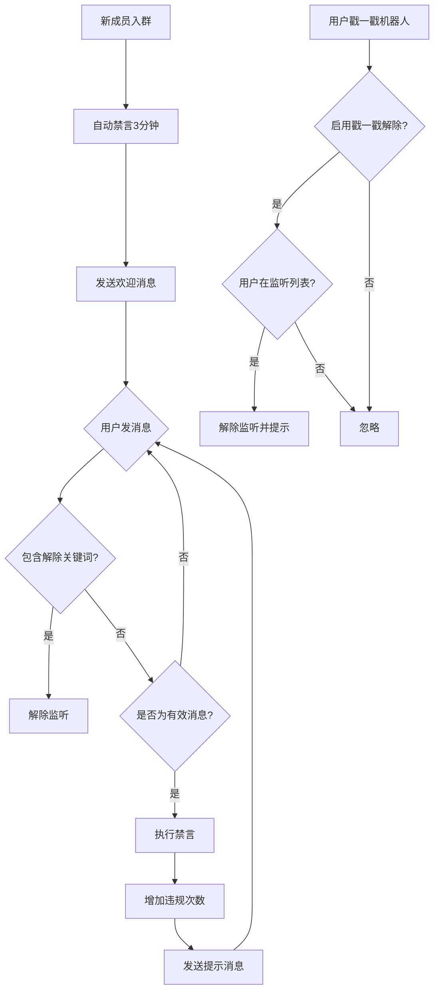

<div align="center">

</div>

# AstrBot 自动禁言新成员插件 v 1.4
又名“进群禁言”  
简体中文 | [EN](https://github.com/nuomicici/astrbot_plugin_auto_ban_new/blob/main/README_en.md) | [日本語](https://github.com/nuomicici/astrbot_plugin_auto_ban_new/blob/main/README_JP.md)

## 📋 插件信息

- **插件名称**: astrbot_plugin_auto_ban_new
- **作者**: 糯米茨
- **版本**: v1.4
- **仓库地址**: [GitHub](https://github.com/nuomicici/astrbot_plugin_auto_ban_new)
- **标签**: 群管、禁言

## 📖 插件简介

在指定群聊中对新入群用户自动禁言并发送欢迎消息，支持多种方式解除监听。帮助群管理员更好地管理新成员，确保新成员先阅读群规再发言。

## 📄 更新日志
### v1.4（当前版本）
- ⚒️ 修复了由于我菜然后出现的权限组漏洞
### v1.3
- ☠️ 哈哈哈！添加了命令功能！
- ✏️ 现已支持通过命令调整配置，无需每次修改都去插件页面了（群管理员均可修改，bot主人不受该限制）
- 🎵 通过命令` /进群禁言帮助`获取命令列表
- ✅ 对于bot不是群管理员的情况，会提示无法使用功能~
- 2025.09.17更新
### v1.2
- 🔐 添加了开关进群监听功能
    - 可以在配置界面关闭后续监听禁言
    - 已被列入监听列表的成员在关闭后不会被禁言，但再次启用监听仍会被禁言
    - 关闭后进群的成员不会被加入监听列表
    - 2025.09.17更新
### v1.1 
- ✨ 添加了退群或踢出判断，在群员退出群聊时删除其数据，减少空间占用
- 🔒 添加了对于违规用户的限制措施，被禁言指定次数时可以自动发送文本并踢出群聊
- 2025.09.05更新
### v1.0 
- ✨ 初始版本发布
- 🔒 支持自动禁言新成员
- 🎯 递进式禁言机制
- 🔓 多种解除监听方式
- ⚙️ 完整的配置系统
- 💾 数据持久化存储

## ✨ 主要功能

### 🔒 自动禁言机制
- **新成员入群**: 自动禁言并发送欢迎消息
- **递进式禁言**: 根据违规次数逐步增加禁言时长
  - 第1次: 180秒（3分钟）
  - 第2次: 180秒（3分钟）
  - 第3次: 600秒（10分钟）
  - 第4次及以后: 3600秒（1小时）
- **成员退群清除**： 识别群员离开群聊，自动删除监听列表，防止储存文件无限制添加数据
- **自动踢出**： 对于多次违规的用户，设置了次数上限，达到次数自动踢出

### 🎯 智能消息过滤
- 自动识别有效消息（文本、@、图片、视频等）
- 忽略无效消息（戳一戳、系统消息等）
- 避免误触发禁言

### 🔓 多种解除监听方式

#### 1. 关键词解除
- 用户发送包含白名单关键词的消息即可解除监听
- 默认关键词：`我已阅读并同意遵守群规`
- 支持自定义关键词列表

#### 2. 戳一戳解除
- 被监听用户戳一戳机器人即可解除监听
- 可通过配置文件开启/关闭此功能
- 解除后会发送友好提示消息

### ⚙️ 灵活配置系统
- 支持通过 AstrBot 管理面板可视化配置
- 所有参数均可自定义
- 配置实时生效，无需重启

## 🚀 安装方法

- 直接在astrbot的插件市场搜索“进群禁言”，点击安装，等待完成即可

- 也可以克隆源码到插件文件夹：

```bash
# 克隆仓库到插件目录
cd /AstrBot/data/plugins
git clone https://github.com/nuomicici/astrbot_plugin_auto_ban_new

# 控制台重启AstrBot
```

## ⚙️ 配置说明

### 基础配置

| 配置项 | 类型 | 说明 | 默认值 |
|--------|------|------|--------|
| `target_groups` | 列表 | 启用功能的群号列表 | `[空]` |
| `welcome_message` | 文本 | 新成员入群欢迎消息 | 默认欢迎词 |

### 禁言时长配置

| 配置项 | 类型 | 说明 | 默认值 |
|--------|------|------|--------|
| `first_ban` | 整数 | 第1次禁言时长（秒） | `180` |
| `second_ban` | 整数 | 第2次禁言时长（秒） | `180` |
| `third_ban` | 整数 | 第3次禁言时长（秒） | `600` |
| `fourth_and_more_ban` | 整数 | 第4次及以后禁言时长（秒） | `3600` |

### 提示消息配置

| 配置项 | 类型 | 说明 |
|--------|------|------|
| `first_message` | 文本 | 第1次禁言提示 |
| `second_message` | 文本 | 第2次禁言提示 |
| `third_message` | 文本 | 第3次禁言提示 |
| `fourth_and_more_message` | 文本 | 第4次及以后禁言提示 |

### 解除监听配置

| 配置项 | 类型 | 说明 | 默认值 |
|--------|------|------|--------|
| `whitelist_keywords` | 列表 | 解除监听关键词 | `["我已阅读并同意遵守群规"]` |
| `whitelist_success_message` | 文本 | 关键字解除成功后发送的纯文本提示，留空则不提示 | `"检测到您已阅读群规，已取消监控，欢迎正常发言~"` |
| `enable_poke_whitelist` | 布尔 | 启用戳一戳解除监听 | `false` |
| `poke_whitelist_message` | 文本 | 戳一戳解除监听提示 | 默认提示词 |

### 踢出相关配置

| 配置项 | 类型 | 说明 | 默认值 |
|--------|------|------|--------|
| `kick_threshold` | 整数 | 禁言次数踢出阈值（包括入群禁言那一次） | `7` |
| `kick_message` | 文本 | 踢出群聊时的提示词 | 默认提示词 |

## 📝 使用说明

### 管理员操作
1. 在 AstrBot 管理面板中配置目标群号
2. 根据需要调整禁言时长和提示消息
3. 自定义解除监听关键词
4. 启用或关闭戳一戳解除监听功能

### 用户操作
新成员入群后：
1. **正常流程**: 阅读群规 → 发送解除关键词 → 正常发言
2. **快速解除**: 戳一戳机器人 → 立即解除监听
3. **违规处理**: 未解除监听直接发言 → 自动禁言并提示

## 🔧 工作流程



## 📊 数据存储

插件会在 `data/auto_ban_plugin/banned_users.json` 中存储用户监听状态：
- 持久化存储，重启后数据不丢失
- 自动备份和恢复机制
- 格式：`[[群ID, 用户ID], 违规次数]`

## ⚠️ 注意事项

1. **权限要求**: 机器人需要群管理员权限才能执行禁言操作
2. **群号配置**: 请确保在配置中正确填写目标群号
3. **消息过滤**: 插件会自动过滤系统消息，避免误触发
4. **高优先级**: 插件使用高优先级处理，确保功能正常运行

## 🐛 故障排除

### 常见问题

**Q: 插件不工作怎么办？**
A: 检查以下项目：
- 机器人是否有管理员权限
- 目标群号是否正确配置
- 插件是否正确安装和启用

**Q: 禁言失败怎么办？**
A: 通常是权限问题：
- 确保机器人是群管理员
- 检查被禁言用户不是群主或其他管理员

**Q: 配置修改后不生效？**
A: 配置修改后会立即生效，如果仍有问题：
- 检查配置格式是否正确
- 重启 AstrBot 服务

## 🤝 贡献

欢迎提交 Issue 和 Pull Request！

## 📄 许可证

本项目采用 MIT 许可证 - 查看 [LICENSE](LICENSE) 文件了解详情。

---

**作者**: 糯米茨  
**联系方式**: 
- [GitHub Issues](https://github.com/nuomicici/astrbot_plugin_auto_ban_new/issues)  
- [QQ](https://qm.qq.com/q/wMGXYfKKoS)
